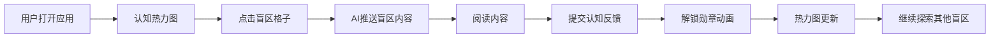

# 茧房爆破器 MVP — 产品需求文档

## 1. 产品概述

世界上第一个反推荐引擎 — 算法目标不是「你看了多久」,而是「你接触了多少你从没见过的东西」。通过认知热力图可视化用户的信息茧房,主动推送盲区内容,用勋章机制游戏化激励认知扩张。

- **核心问题**:推荐算法最大化停留时长导致信息茧房、认知窄化
- **目标用户**:18-35岁知识工作者、大学生、内容创作者
- **市场价值**:「知识焦虑」已成显学,真正帮用户「看到自己不知道什么」的产品极度稀缺

## 2. 核心功能

### 2.1 用户角色

| 角色 | 注册方式 | 核心权限 |
|------|----------|----------|
| 普通用户 | 模拟用户(MVP阶段) | 查看认知热力图、接收盲区推送、解锁勋章 |

### 2.2 功能模块

1. **认知热力图页(主页)**:24维认知空间可视化、扫描动画、盲区交互
2. **盲区推送卡**:AI推荐内容、推荐理由解释、阅读入口
3. **勋章系统页**:24枚认知勋章、解锁进度、等级展示
4. **阅读详情页**:内容展示、反馈入口、勋章解锁动画

### 2.3 页面详情

| 页面名称 | 模块名称 | 功能描述 |
|----------|----------|----------|
| 认知热力图页 | Hero区 | 产品标语 + 「立即扫描」CTA按钮 |
| 认知热力图页 | 热力图网格 | 24个认知维度格子,颜色深浅代表暴露强度,蓝色斜纹=盲区 |
| 认知热力图页 | 扫描动画 | 点击扫描后雷达扫描效果,数据渐进填充 |
| 认知热力图页 | 图例说明 | 5档颜色对应的暴露等级 |
| 盲区推送卡 | 推荐理由 | 「推荐这条是因为你过去30天从未接触过XX」 |
| 盲区推送卡 | 内容预览 | 标题、摘要、来源 |
| 盲区推送卡 | 操作按钮 | 「去阅读」「换一条」 |
| 阅读详情页 | 正文内容 | 完整文章/知识内容展示 |
| 阅读详情页 | 反馈区 | 「这刷新了我什么认知?」开放式反馈 |
| 阅读详情页 | 勋章解锁 | 完成阅读+反馈后触发勋章解锁动画 |
| 勋章页 | 勋章墙 | 24枚勋章按认知维度排列,已解锁/未解锁状态 |
| 勋章页 | 进度统计 | 已突破维度数、总阅读数、连续突破天数 |

## 3. 核心流程

```
用户打开应用 → 看到自己的认知热力图 → 点击蓝色盲区格子
→ AI推送该维度的高质量内容 → 用户阅读内容 → 完成反馈
→ 解锁对应勋章 → 热力图更新(盲区变绿色) → 继续探索其他盲区
```



## 4. 用户界面设计

### 4.1 设计风格

- **主色调**:深红色 `#ff4d4d`(象征爆破、突破)+ 深青蓝 `#00d4ff`(象征盲区、未知)
- **背景**:极深灰 `#0a0a0f`,配渐变光晕(左上红、右下蓝)
- **按钮风格**:圆角胶囊形,主按钮带渐变和发光阴影
- **字体**:中文系统字体栈,标题粗体大字,正文精致小字
- **布局风格**:卡片式+网格化,热力图是视觉中心
- **图标风格**:Lucide 线性图标,统一线宽
- **整体氛围**:科技感、游戏感、暗黑模式,像一个「认知健身」的仪表盘

### 4.2 页面设计概览

| 页面名称 | 模块名称 | UI元素 |
|----------|----------|--------|
| 热力图主页 | Hero | 大号渐变标题 + 扫描按钮 + 脉冲光环 |
| 热力图主页 | 热力图网格 | 6x4格子,悬停放大,点击触发推送 |
| 热力图主页 | 推送抽屉 | 从底部滑入,左红边,推荐理由+内容+按钮 |
| 勋章页 | 勋章墙 | 4x6网格,未解锁灰色,已解锁金色发光 |
| 勋章页 | 统计条 | 数字+进度条,成就展示 |

### 4.3 响应式

- 桌面端优先,移动端自适应
- 热力图在移动端从6列变4列
- 推送卡全屏展示
- 触摸优化:加大点击区域,滑动手势

### 4.4 动效设计

- **扫描动画**:雷达式从上到下扫描线,格子逐个点亮
- **推送卡入场**:从底部滑入+淡入
- **勋章解锁**:光晕爆炸 + 粒子效果 + 上浮
- **页面切换**:淡入淡出 + 轻微位移
- **悬停态**:格子放大+发光,按钮上浮
