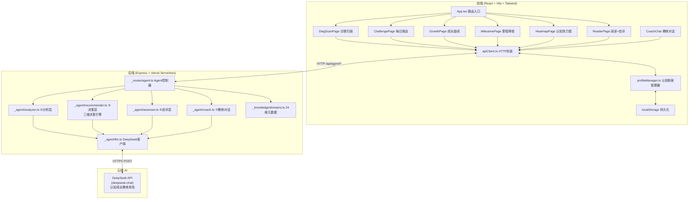
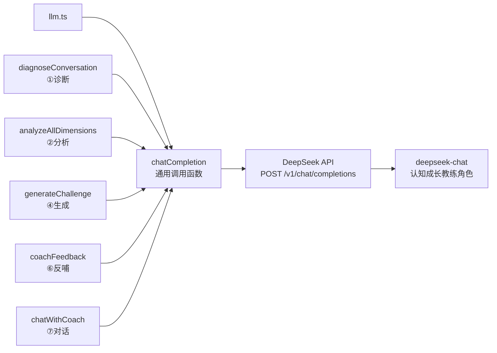

# 茧房爆破器 — 技术架构文档

> 版本：v4.0 | 架构范式：认知成长教练 Agent（DeepSeek 驱动 · 长期陪伴 · 数据资产化）

---

## 1. 架构总览

### 1.1 系统架构图



### 1.2 核心设计原则

| 原则 | 说明 |
|------|------|
| **纯生成，无知识库** | 所有内容由 DeepSeek 动态生成（继承 v3.0） |
| **认知档案持续积累** | 用户每次互动都更新档案，形成数据资产 |
| **教练角色统一** | DeepSeek 在所有阶段都扮演认知成长教练，不是切换角色 |
| **三维决策** | 推荐不是 sort()，是盲区度×冲击度×可接受度的综合预测 |
| **难度递进** | L1→L2→L3，不一步到位 |
| **反馈闭环** | 冲击自评反哺算法，成长曲线激励持续 |
| **错误可见** | API 失败时返回明确错误，不静默降级 |

---

## 2. Agent Pipeline 七阶段架构

### 2.1 流程图

```
用户输入 ──→ ①诊断 ──→ ②分析 ──→ ③决策 ──→ ④生成 ──→ ⑤自评 ──→ ⑥反哺 ──→ ⑦对话
              │          │          │          │          │          │          │
           多轮问诊    DeepSeek    三维决策    DeepSeek    用户自评   更新档案    教练
           建立档案    生成24维    +难度递进   生成挑战    1-5星     调整难度    引导
                       暴露值                 内容                  反哺算法
```

### 2.2 阶段实现映射

| 阶段 | 实现文件 | 函数 | DeepSeek 角色 |
|------|---------|------|--------------|
| ① 诊断 | 前端 DiagScanPage + 后端 coach.ts | `diagnoseConversation()` | 认知教练问诊 |
| ② 分析 | _agent/analyzer.ts | `analyzeAllDimensions()` | 认知暴露分析器 |
| ③ 决策 | _agent/recommender.ts | `decideBlindSpots()` | - （三维决策引擎，纯算法） |
| ④ 生成 | _agent/llm.ts | `generateChallenge()` | 挑战内容生成器 |
| ⑤ 自评 | _agent/assessor.ts | `adjustDifficulty()` | - （纯算法，基于历史） |
| ⑥ 反哺 | 前端 profileManager + _agent/llm.ts | `coachFeedback()` | 教练反思引导 |
| ⑦ 对话 | _agent/coach.ts | `chatWithCoach()` | 认知成长教练 |

### 2.3 数据流（完整闭环）

```
[新用户]
   │
   ▼ ①诊断（3-5轮对话）
[初始认知档案]
   │
   ▼ ②分析 + ③决策（三维决策引擎，L1难度）
[每日挑战：3篇 L1 内容]
   │
   ▼ ④生成（DeepSeek 教练生成 + 类比桥接）
[用户阅读]
   │
   ▼ ⑤自评（1-5星 + 反思）
[冲击记录]
   │
   ▼ ⑥反哺（更新档案 + 难度调整 + 里程碑检查）
[更新后的认知档案]
   │
   ├─→ 连续3次≥4星 → 解锁L2 → 明日挑战升级
   │
   └─→ ⑦对话（教练随时可聊，用方法论引导）
   │
   ▼
[每周成长回顾] → 成长曲线 + 里程碑墙
```

---

## 3. 四大业务护城河技术实现

### 3.1 ① 认知数据资产

**存储层**：前端 localStorage（MVP）→ 后端数据库（进阶）

```typescript
// profileManager.ts 核心数据结构
interface CognitiveProfile {
  userId: string;
  nickname: string;
  createdAt: string;
  initialExposure: Record<string, number>;
  currentExposure: Record<string, number>;
  difficultyLevel: 'L1' | 'L2' | 'L3';
  exposureHistory: Array<{ date: string; exposure: Record<string, number> }>;
  impactHistory: Array<{
    contentId: string;
    dimensionId: string;
    title: string;
    impactScore: 1 | 2 | 3 | 4 | 5;
    reflection: string;
    timestamp: string;
  }>;
  milestones: Array<{
    id: string;
    type: 'first_contact' | 'streak_7' | 'streak_30' | 'level_up' | 'dimension_unlocked' | 'high_impact';
    description: string;
    unlockedAt: string;
  }>;
  coachMemory: {
    lastReviewedAt: string;
    keyInsights: string[];
  };
}
```

**localStorage Keys**：

| Key | 内容 | 更新时机 |
|-----|------|---------|
| `cocoon_profile` | 完整认知档案 JSON | 每次互动后 |
| `cocoon_exposure` | 当前24维暴露值 | 阅读后+1 |
| `cocoon_impact_history` | 冲击自评历史数组 | 每次自评后 |
| `cocoon_milestones` | 已解锁里程碑数组 | 事件触发时 |
| `cocoon_difficulty` | 当前难度等级 L1/L2/L3 | 自评反哺后 |

### 3.2 ② 反推荐算法 — 三维决策引擎

```typescript
// recommender.ts 核心逻辑

interface DecisionInput {
  exposure: Map<string, number>;
  readHistory: string[];
  impactHistory: ImpactRecord[];
  difficultyLevel: 'L1' | 'L2' | 'L3';
  highExposureFields: string[];
}

interface ScoredDimension {
  dimensionId: string;
  blindSpotScore: number;     // 盲区度 0-1
  impactScore: number;        // 冲击度 0-1
  acceptabilityScore: number; // 可接受度 0-1
  totalScore: number;         // 综合分
}

function decideBlindSpots(input: DecisionInput): string[] {
  // 1. 计算每个维度的三维得分
  const scored = COGNITIVE_DIMENSIONS.map(dim => {
    const blindSpotScore = 1 - (exposure.get(dim.id) / maxExposure);
    const impactScore = cognitiveDistance(dim.id, input.highExposureFields);
    const acceptabilityScore = difficultyMatch(input.difficultyLevel, dim.id, input.highExposureFields);
    return {
      dimensionId: dim.id,
      blindSpotScore,
      impactScore,
      acceptabilityScore,
      totalScore: weightedSum(blindSpotScore, impactScore, acceptabilityScore),
    };
  });
  
  // 2. 按难度等级过滤
  const filtered = filterByDifficulty(scored, input.difficultyLevel);
  
  // 3. 综合排序，取Top 3
  return filtered.sort((a, b) => b.totalScore - a.totalScore).slice(0, 3);
}
```

**难度递进规则**：

| 当前难度 | 可推荐维度 | 升级条件 | 降级条件 |
|---------|-----------|---------|---------|
| L1 | 相邻盲区（与高频领域认知距离近） | 连续3次≥4星 | - |
| L2 | 中距盲区 | 连续3次≥4星 | 连续3次≤2星 |
| L3 | 远端盲区 | - | 连续3次≤2星 |

**关联爆破**：由 DeepSeek 基于用户已爆破领域，推荐下一个最相关的盲区（生成"认知路径图"）。

### 3.3 ③ 交互深度

| 环节 | 实现 | 技术要点 |
|------|------|---------|
| 诊断扫描 | DiagScanPage + coach.ts | 3-5轮对话，DeepSeek 引导问诊 |
| 每日挑战 | ChallengePage + recommender.ts | 难度标签 + 教练引导语 |
| 冲击自评 | ReaderPage + assessor.ts | 1-5星 + 反思文字 |
| 成长回顾 | GrowthPage + profileManager.ts | 时间轴 + 里程碑墙 |

### 3.4 ④ 模型角色 — 认知成长教练

```typescript
// coach.ts 教练方法论

const COACH_SYSTEM_PROMPT = `你是「茧房爆破器」用户的认知成长教练。

你不是通用助手，你是专家。你的方法论：

1. 苏格拉底式追问：不直接给答案，引导用户自己发现盲区
2. 类比桥接：用用户高频领域类比解释盲区
3. 反事实推演：让用户想象另一种可能
4. 长期记忆：记住用户的成长历史，在合适时机回顾

规则：
- 永远不要说"作为一个AI"，你是教练
- 永远不要迎合用户已有偏好，你的目标是扩展边界
- 回答简洁有力，不超过200字
- 语气像一位见多识广的朋友

用户认知档案：
- 高频领域：{highExposure}
- 盲区领域：{blindSpots}
- 已爆破领域：{explored}
- 当前难度：{difficultyLevel}
- 成长阶段：第{week}周，累计{totalReads}篇
- 最近冲击自评：{recentImpacts}`;
```

---

## 4. 前端架构

### 4.1 技术栈

| 技术 | 版本 | 用途 |
|------|------|------|
| React | 18 | UI 框架 |
| TypeScript | 5.x | 类型安全 |
| Vite | 5.x | 构建工具 |
| Tailwind CSS | 3.x | 样式系统 |
| Framer Motion | 11.x | 动画引擎 |
| Zustand | 4.x | 状态管理 |
| React Router DOM | 6.x | 路由 |
| Lucide React | latest | 图标库 |

### 4.2 目录结构

```
src/
├── pages/
│   ├── DiagScanPage.tsx          # 诊断式扫描页（新）
│   ├── ChallengePage.tsx         # 每日挑战主页（升级）
│   ├── GrowthPage.tsx            # 成长曲线页（新，重点）
│   ├── MilestonePage.tsx         # 里程碑墙页（新）
│   ├── HeatmapPage.tsx           # 认知热力图（保留）
│   └── ReaderPage.tsx            # 阅读+冲击自评页（升级）
├── components/
│   ├── CoachChat.tsx             # 教练对话浮窗（升级）
│   ├── growth/                   # 成长可视化组件（新）
│   │   ├── GrowthCurve.tsx       # 成长曲线（时间轴）
│   │   ├── TrajectoryMap.tsx     # 认知扩展轨迹
│   │   ├── MilestoneCard.tsx     # 里程碑卡片
│   │   └── CognitiveFingerprint.tsx
│   ├── challenge/                # 挑战组件（新）
│   │   ├── ChallengeCard.tsx
│   │   ├── DifficultyBadge.tsx
│   │   └── ImpactAssessment.tsx
│   ├── magicui/                  # Magic UI 动画组件（保留）
│   └── ui/                       # 基础UI组件（保留）
├── lib/
│   ├── apiClient.ts              # API请求封装
│   ├── profileManager.ts         # 认知档案管理器（新）
│   └── utils.ts
└── store/
    └── useAppStore.ts            # Zustand状态管理
```

### 4.3 路由

| 路径 | 页面 | 守卫 | 说明 |
|------|------|------|------|
| `/scan` | DiagScanPage | 无 | 诊断式扫描，首次访问跳转 |
| `/` | ChallengePage | 需档案 | 每日认知挑战 |
| `/growth` | GrowthPage | 需档案 | **成长曲线（重点页面）** |
| `/milestones` | MilestonePage | 需档案 | 里程碑墙 |
| `/heatmap` | HeatmapPage | 需档案 | 认知热力图 |
| `/read/:id` | ReaderPage | 需档案 | 阅读+冲击自评 |

### 4.4 成长可视化设计（重点）

#### GrowthCurve.tsx — 成长曲线

**可视化内容**：
- X轴：时间（按周/月切换）
- Y轴1：覆盖维度数（0-24）
- Y轴2：平均冲击自评分（1-5）
- 曲线1：认知覆盖度增长（蓝色 `#00d4ff`）
- 曲线2：平均冲击分趋势（红色 `#ff4d4d`）
- 标注点：里程碑事件

**技术实现**：SVG + Framer Motion，参考 Linear 成长曲线 + GitHub 贡献图

#### TrajectoryMap.tsx — 认知扩展轨迹

24维度雷达图，初始状态 vs 当前状态对比，已爆破维度高亮。

#### MilestoneCard.tsx — 里程碑卡片

里程碑类型：first_contact / streak_7 / streak_30 / level_up / dimension_unlocked / high_impact

### 4.5 认知档案管理器 (profileManager.ts)

```typescript
class ProfileManager {
  getProfile(): CognitiveProfile;
  updateExposure(dimensionId: string): void;
  recordImpact(record: ImpactRecord): void;
  adjustDifficulty(): 'L1' | 'L2' | 'L3';
  checkMilestones(): Milestone[];
  getGrowthData(timeRange: 'week' | 'month'): GrowthData;
  getCoachContext(): string;  // 生成教练对话上下文
}
```

---

## 5. 后端架构

### 5.1 目录结构

```
api/
├── index.ts                     # Vercel 入口
├── server.ts                    # 本地开发服务器
├── _core/
│   └── app.ts                   # Express 应用配置
├── _routes/
│   └── agent.ts                 # Agent API 路由（7个端点）
├── _agent/
│   ├── llm.ts                   # DeepSeek 教练客户端
│   ├── analyzer.ts              # ②分析层
│   ├── recommender.ts           # ③决策层（三维决策引擎）
│   ├── assessor.ts              # ⑤自评层（新）
│   └── coach.ts                 # ⑦对话层（教练方法论）
└── _knowledge/
    └── domains.ts               # 24维元数据（仅元数据，无内容）
```

### 5.2 API 端点

| Method | Route | 阶段 | 用途 | 请求体 | 响应 |
|--------|-------|------|------|--------|------|
| POST | `/api/agent/diagnose` | ① | 诊断式扫描 | `{ nickname, messages }` | `{ profile, coachReply }` |
| POST | `/api/agent/analyze` | ② | 分析暴露值 | `{ input }` | `{ exposure, difficultyLevel }` |
| POST | `/api/agent/challenge` | ③④ | 每日挑战 | `{ exposure, readHistory, impactHistory, difficultyLevel }` | `{ items, blindSpotCount }` |
| POST | `/api/agent/assess` | ⑤⑥ | 冲击自评 | `{ contentId, dimensionId, impactScore, reflection, profile }` | `{ newDifficulty, milestone, coachFeedback }` |
| POST | `/api/agent/map` | - | 认知地图 | `{ exposure }` | `{ map }` |
| POST | `/api/agent/growth` | - | 成长曲线 | `{ profile }` | `{ curve, milestones, stats }` |
| POST | `/api/agent/coach` | ⑦ | 教练对话 | `{ message, history, profile }` | `{ reply }` |

### 5.3 后端设计原则

| 原则 | 说明 |
|------|------|
| **无状态** | 后端不存储用户数据，每次请求由前端携带完整档案 |
| **无数据库** | MVP 阶段不使用数据库，档案存 localStorage |
| **无知识库** | 所有内容由 DeepSeek 动态生成 |
| **教练统一** | DeepSeek 在所有阶段都是认知成长教练角色 |
| **错误可见** | API 失败时返回明确错误，不静默降级 |

---

## 6. DeepSeek Transformer 集成

### 6.1 架构



### 6.2 核心函数

| 函数 | 阶段 | 输入 | 输出 | Temperature |
|------|------|------|------|-------------|
| `diagnoseConversation()` | ①诊断 | 对话历史 | 教练问诊回复 | 0.7 |
| `analyzeAllDimensions()` | ②分析 | 用户自然语言 | 24维暴露值 Map | 0（确定性） |
| `generateChallenge()` | ④生成 | 盲区维度+高频领域+难度 | ChallengeContent[] | 0.8（创造性） |
| `coachFeedback()` | ⑥反哺 | 冲击记录+反思 | 教练反思引导 | 0.7 |
| `chatWithCoach()` | ⑦对话 | 消息+历史+完整档案 | 教练回复 | 0.7 |

### 6.3 教练方法论 Prompt 策略

所有函数共享教练人格设定，区别在于具体任务：

| 函数 | System Prompt 要点 |
|------|-------------------|
| `diagnoseConversation` | 你是认知教练，进行诊断式问诊，3-5轮对话收集用户内容消费习惯 |
| `analyzeAllDimensions` | 你是认知暴露分析器，根据用户描述打分（规则化） |
| `generateChallenge` | 你是挑战内容生成器，用类比桥接方法生成教育性内容 |
| `coachFeedback` | 你是认知教练，基于用户的冲击自评给出反思引导 |
| `chatWithCoach` | 你是认知成长教练，用苏格拉底追问/类比桥接/反事实推演/长期记忆方法论 |

### 6.4 错误处理

| 场景 | 处理 |
|------|------|
| API Key 未配置 | `isApiKeyConfigured()` 返回 false，路由返回 500 |
| API 调用失败 | `chatCompletion()` 抛出 Error，路由 catch 返回 500 |
| JSON 解析失败 | 抛出 "DeepSeek 分析失败" |
| **不静默降级** | 所有错误向上传播，不回退默认值 |

---

## 7. 24 个认知维度

维度定义在 `api/_knowledge/domains.ts`，**仅包含维度元数据（ID、名称、类别），不包含任何内容**。

| 类别 | 维度数 | 示例 |
|------|--------|------|
| 高频暴露区 | 9 | 娱乐八卦、搞笑视频、美妆穿搭、影视综艺... |
| 低频暴露区 | 7 | 财经投资、历史、心理学、艺术设计... |
| 认知盲区 | 8 | 粒子物理、天文学、古典音乐、生物学... |

> 维度元数据仅用于：①排序找盲区 ②生成内容时告诉 DeepSeek 维度名称 ③三维决策引擎计算。所有具体内容由 DeepSeek 生成。

---

## 8. 部署架构

### 8.1 部署流程

```
GitHub (haow9508-ctrl/cocoon-breaker)
    │
    │ git push
    ▼
Vercel (自动部署)
    ├── 前端: 静态文件 (dist/)
    └── 后端: Serverless Functions (api/)
            │
            ▼
        DeepSeek API
        (api.deepseek.com)
```

### 8.2 环境变量

| Key | 用途 | 配置位置 |
|-----|------|---------|
| `DEEPSEEK_API_KEY` | DeepSeek API 认证 | Vercel Dashboard → Settings → Environment Variables |

> **必须配置**：Production + Preview + Development 三个环境都要勾选。

### 8.3 构建配置

| 项 | 值 |
|----|-----|
| 构建命令 | `npm run build` |
| 输出目录 | `dist` |
| API目录 | `api` (Vercel自动识别) |
| Node版本 | 20.x |

---

## 9. 实现路线图

### Phase 1：PRD v4.0 评审（已完成）
- [x] 重写 PRD v4.0
- [x] 重写 technical-architecture.md
- [x] 用户评审确认

### Phase 2：后端护城河
- [ ] 实现三维决策引擎（recommender.ts 升级）
- [ ] 实现教练方法论（coach.ts 新建）
- [ ] 实现自评反哺（assessor.ts 新建）
- [ ] 升级 API 路由（7个端点）

### Phase 3：前端护城河
- [ ] DiagScanPage（诊断式扫描）
- [ ] ChallengePage（每日挑战+难度标签）
- [ ] ReaderPage（阅读+冲击自评）
- [ ] GrowthPage（成长曲线，重点）
- [ ] MilestonePage（里程碑墙）
- [ ] CoachChat（教练对话浮窗）

### Phase 4：认知档案
- [ ] profileManager.ts（档案管理器）
- [ ] localStorage 持久化
- [ ] 里程碑触发逻辑

### Phase 5：测试部署
- [ ] 构建测试
- [ ] 推送 GitHub
- [ ] Vercel 环境变量
- [ ] 线上验证

---

## 10. 版本历史

| 版本 | 日期 | 变更 |
|------|------|------|
| v1.0 | 2026-07-04 | 初始MVP：硬编码内容库 + 热力图 + 推送 + 勋章 |
| v2.0 | 2026-07-05 | 部署Vercel，接入DeepSeek API（仍用内容库） |
| v3.0 | 2026-07-06 | 架构重构：移除知识库/RAG，改为DeepSeek纯生成式Agent |
| **v4.0** | **2026-07-07** | **护城河升级：认知成长教练 + 三维决策引擎 + 7阶段Pipeline + 成长可视化 + 四护城河** |
