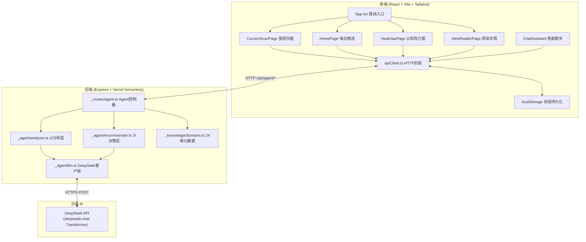
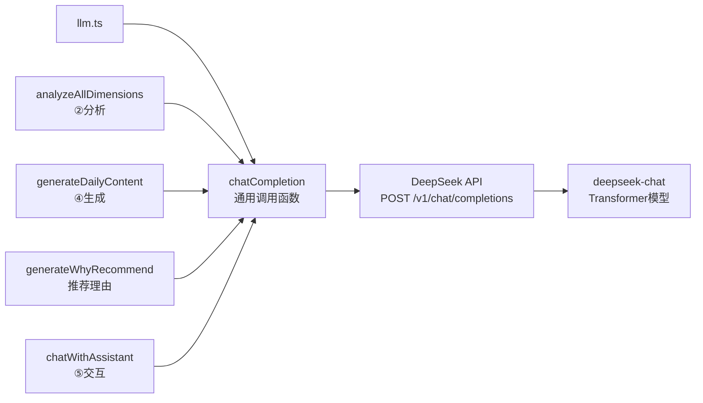

# 茧房爆破器 — 技术架构文档

> 版本：v3.0 | 架构范式：纯生成式 Agent（无知识库、无 RAG）

---

## 1. 架构总览

### 1.1 系统架构图



### 1.2 核心设计原则

| 原则 | 说明 |
|------|------|
| **纯生成，无知识库** | 所有内容由 DeepSeek Transformer 动态生成，不从任何本地数据库/知识库中检索 |
| **无 RAG** | 不使用检索增强生成，DeepSeek 的训练数据本身就是知识源 |
| **无状态后端** | 后端不存储任何用户数据，每次请求由前端携带用户暴露数据 |
| **每用户独立 Agent** | 每个用户的暴露画像作为 Agent 上下文，驱动个性化生成 |
| **DeepSeek = 大脑 + 内容源** | DeepSeek 同时承担分析、决策、内容生成、对话四种角色 |
| **错误可见** | API 失败时返回明确错误，不静默降级到默认值 |

---

## 2. Agent Pipeline 五阶段架构

### 2.1 流程图

```
用户输入 ──→ ①感知 ──→ ②分析 ──→ ③决策 ──→ ④生成 ──→ ⑤交互
                │          │          │          │          │
             收集用户    DeepSeek    按暴露值    DeepSeek    多轮
             消费习惯    生成24维    升序排序    生成具体    对话
             自然语言    暴露值     选Top3     盲区内容
```

### 2.2 阶段实现映射

| 阶段 | 实现文件 | 函数 | DeepSeek 角色 |
|------|---------|------|--------------|
| ① 感知 | 前端 CocoonScanPage | - | - |
| ② 分析 | _agent/analyzer.ts | `buildExposureMap()` → `analyzeAllDimensions()` | 认知暴露分析器 |
| ③ 决策 | _agent/recommender.ts | `generateDailyFeed()` | - （纯算法排序） |
| ④ 生成 | _agent/llm.ts | `generateDailyContent()` | 反推荐内容生成器 |
| ⑤ 交互 | _agent/llm.ts | `chatWithAssistant()` | 智能对话助手 |

### 2.3 数据流

```
[用户] --输入消费习惯--> [扫描页]
                           │
                           ▼ POST /api/agent/scan
                    [Agent: ①感知→②分析]
                           │
                           ▼ 24维暴露值 (JSON)
                    [存入 localStorage]
                           │
                           ▼ POST /api/agent/daily
                    [Agent: ③决策→④生成]
                           │
                           ▼ 3篇动态生成的内容
                    [推送主页展示]
                           │
                           ├─→ 用户阅读 → 更新暴露值 → 回到③
                           │
                           └─→ 用户对话 → POST /api/agent/chat
                                      → [Agent: ⑤交互]
                                      → 个性化回复
```

---

## 3. 前端架构

### 3.1 技术栈

| 技术 | 版本 | 用途 |
|------|------|------|
| React | 18 | UI 框架 |
| TypeScript | 5.x | 类型安全 |
| Vite | 5.x | 构建工具 |
| Tailwind CSS | 3.x | 样式系统 |
| Framer Motion | 11.x | 动画引擎 |
| Zustand | 4.x | 状态管理 |
| React Router DOM | 6.x | 路由 |
| Lucide React | latest | 图标库 |

### 3.2 目录结构

```
src/
├── App.tsx                      # 路由配置
├── main.tsx                     # 入口
├── pages/
│   ├── CocoonScanPage.tsx       # 茧房扫描页（首次访问跳转至此）
│   ├── HomePage.tsx             # 每日盲区推送主页
│   ├── HeatmapPage.tsx          # 认知热力图可视化
│   └── ViewReaderPage.tsx       # 阅读详情页
├── components/
│   ├── ChatAssistant.tsx        # 浮动智能聊天助手
│   ├── magicui/                 # Magic UI 风格动画组件
│   │   ├── MagicCard.tsx        # 鼠标跟随高亮卡片
│   │   ├── NumberTicker.tsx     # 数字滚动动画
│   │   ├── BorderBeam.tsx       # 边框光束动画
│   │   └── DotPattern.tsx       # 点阵背景
│   └── ui/                      # 基础UI组件（Button/Card/Input）
├── lib/
│   ├── apiClient.ts             # API请求封装
│   └── utils.ts                 # 工具函数
└── store/
    └── useAppStore.ts           # Zustand状态管理
```

### 3.3 路由

| 路径 | 页面 | 守卫 | 说明 |
|------|------|------|------|
| `/scan` | CocoonScanPage | 无 | 茧房扫描，首次访问自动跳转 |
| `/` | HomePage | 需暴露数据 | 每日盲区推送 |
| `/heatmap` | HeatmapPage | 需暴露数据 | 认知热力图 |
| `/read/:id` | ViewReaderPage | 需暴露数据 | 内容阅读详情 |

### 3.4 API Client (apiClient.ts)

前端所有 API 调用通过 `apiClient.ts` 封装，暴露数据从 localStorage 读取并随请求发送：

```typescript
// 6个核心API函数
scanCocoon(nickname, input)    → POST /api/agent/scan
getDailyFeed()                 → POST /api/agent/daily
getCognitiveMap()              → POST /api/agent/map
getContentDetail(contentId)    → POST /api/agent/content
chatWithAgent(message, history)→ POST /api/agent/chat
markAsRead(contentId, dimId)   → localStorage 更新
```

### 3.5 localStorage 持久化

| Key | 内容 | 说明 |
|-----|------|------|
| `cocoonExposure` | 24维暴露值JSON | 扫描结果 |
| `cocoonReadContentIds` | 已读内容ID数组 | 阅读后更新 |
| `cocoonNickname` | 昵称 | 扫描时输入 |
| `cocoonFeedbacks` | 反馈记录数组 | 阅读后提交 |

---

## 4. 后端架构

### 4.1 技术栈

| 技术 | 用途 |
|------|------|
| Express | HTTP 框架 |
| TypeScript | 类型安全 |
| Vercel Serverless Functions | 部署平台 |
| DeepSeek API (deepseek-chat) | AI能力（分析+生成+对话） |

### 4.2 目录结构

```
api/
├── index.ts                     # 入口，挂载Express应用到Vercel
├── server.ts                    # 本地开发服务器
├── _core/
│   └── app.ts                   # Express应用配置 + CORS + 路由挂载
├── _routes/
│   └── agent.ts                 # Agent API路由（5个端点）
├── _agent/
│   ├── llm.ts                   # DeepSeek LLM客户端（核心AI逻辑）
│   ├── analyzer.ts              # ②暴露值分析器
│   └── recommender.ts           # ③④智能推荐器（动态生成）
└── _knowledge/
    └── domains.ts               # 24个认知维度定义（仅维度元数据，无内容）
```

> **注意**：`_knowledge/` 目录仅包含维度元数据定义（id, name, category），**不包含任何内容库**。所有内容由 DeepSeek 动态生成。

### 4.3 API 端点

| Method | Route | Agent阶段 | 用途 |
|--------|-------|----------|------|
| POST | `/api/agent/scan` | ①② | 茧房扫描，生成24维暴露值 |
| POST | `/api/agent/daily` | ③④ | 每日推送，DeepSeek动态生成3篇内容 |
| POST | `/api/agent/content` | ④ | 内容详情，DeepSeek为单个维度动态生成 |
| POST | `/api/agent/map` | - | 认知地图（纯数据，不需DeepSeek） |
| POST | `/api/agent/chat` | ⑤ | 智能聊天，DeepSeek多轮对话 |

### 4.4 后端设计原则

| 原则 | 说明 |
|------|------|
| **无状态** | 不存储用户数据，每次请求由前端携带 |
| **无数据库** | 不使用任何数据库 |
| **无知识库** | 不使用任何内容库，内容由 DeepSeek 动态生成 |
| **Agent驱动** | 每个API端点对应 Agent Pipeline 的一个阶段 |
| **错误可见** | API 失败时返回明确错误，不静默降级 |

---

## 5. DeepSeek Transformer 集成

### 5.1 架构



### 5.2 核心函数

| 函数 | 阶段 | 输入 | 输出 | Temperature |
|------|------|------|------|-------------|
| `analyzeAllDimensions()` | ②分析 | 用户自然语言 | 24维暴露值 Map | 0（确定性） |
| `generateDailyContent()` | ④生成 | 盲区维度+高频领域 | GeneratedContent[] JSON数组 | 0.8（创造性） |
| `generateWhyRecommend()` | - | 维度名+标题+暴露数据 | 推荐理由字符串 | 0.8 |
| `chatWithAssistant()` | ⑤交互 | 消息+历史+暴露数据 | 回复字符串 | 0.7 |

### 5.3 Prompt 工程策略

#### ②分析层 Prompt
```
System: 你是认知暴露分析器。根据用户描述，为其30天内在这24个维度的
内容接触次数（0-1000整数）打分。
规则：经常看→200-800，偶尔看→50-150，从不看→0-10，未提及→10-30
输出：纯JSON对象，24个key
```

#### ④生成层 Prompt
```
System: 你是「茧房爆破器」的反推荐引擎内容生成器。为用户的认知盲区
动态生成教育性内容。
原则：
1. 内容必须与用户高频领域形成认知冲击和对比
2. 标题要有吸引力、有悬念
3. 摘要150-200字，有洞察力和冲击力
4. 来源标注真实（维基百科/学术论文/经典著作）
5. 阅读时间5-10分钟
输出：JSON数组
```

#### ⑤交互层 Prompt
```
System: 你是「茧房爆破器」的智能助手。
用户认知数据：高频领域=[...]，盲区领域=[...]
职责：
1. 根据暴露数据个性化回答
2. 推荐时描述领域价值，不需具体文章
3. 介绍领域与用户高频领域的关联
4. 回答简洁有力，不超过200字
5. 语气像朋友聊天，不要太AI
```

### 5.4 错误处理

| 场景 | 处理 |
|------|------|
| API Key 未配置 | `isApiKeyConfigured()` 返回 false，路由返回 500 |
| API 调用失败 | `chatCompletion()` 抛出 Error，路由 catch 返回 500 |
| JSON 解析失败 | `analyzeAllDimensions()` 抛出 "DeepSeek 分析失败" |
| **不静默降级** | 所有错误向上传播，不回退默认值 |

---

## 6. 24 个认知维度

维度定义在 `api/_knowledge/domains.ts`，**仅包含维度元数据（ID、名称、类别），不包含任何内容**。

| 类别 | 维度数 | 示例 |
|------|--------|------|
| 高频暴露区 | 9 | 娱乐八卦、搞笑视频、美妆穿搭、影视综艺... |
| 低频暴露区 | 7 | 财经投资、历史、心理学、艺术设计... |
| 认知盲区 | 8 | 粒子物理、天文学、古典音乐、生物学... |

> 维度元数据仅用于：①排序找盲区 ②生成内容时告诉 DeepSeek 维度名称。所有具体内容由 DeepSeek 生成。

---

## 7. 部署架构

### 7.1 部署流程

```
GitHub (haow9508-ctrl/cocoon-breaker)
    │
    │ git push
    ▼
Vercel (自动部署)
    ├── 前端: 静态文件 (dist/)
    └── 后端: Serverless Functions (api/)
            │
            ▼
        DeepSeek API
        (api.deepseek.com)
```

### 7.2 环境变量

| Key | 用途 | 配置位置 |
|-----|------|---------|
| `DEEPSEEK_API_KEY` | DeepSeek API 认证 | Vercel Dashboard → Settings → Environment Variables |

> **必须配置**：Production + Preview + Development 三个环境都要勾选。
> 如果未配置，所有 Agent 功能将完全失效（不是降级，是报错）。

### 7.3 构建配置

| 项 | 值 |
|----|-----|
| 构建命令 | `npm run build` |
| 输出目录 | `dist` |
| API目录 | `api` (Vercel自动识别) |
| Node版本 | 20.x |

---

## 8. 版本历史

| 版本 | 日期 | 变更 |
|------|------|------|
| v1.0 | 2026-07-04 | 初始MVP：硬编码内容库 + 热力图 + 推送 + 勋章 |
| v2.0 | 2026-07-05 | 部署Vercel，接入DeepSeek API（仍用内容库） |
| v3.0 | 2026-07-06 | **架构重构**：移除知识库/RAG，改为DeepSeek纯生成式Agent；删除content.ts内容库文件；五阶段Pipeline架构 |
