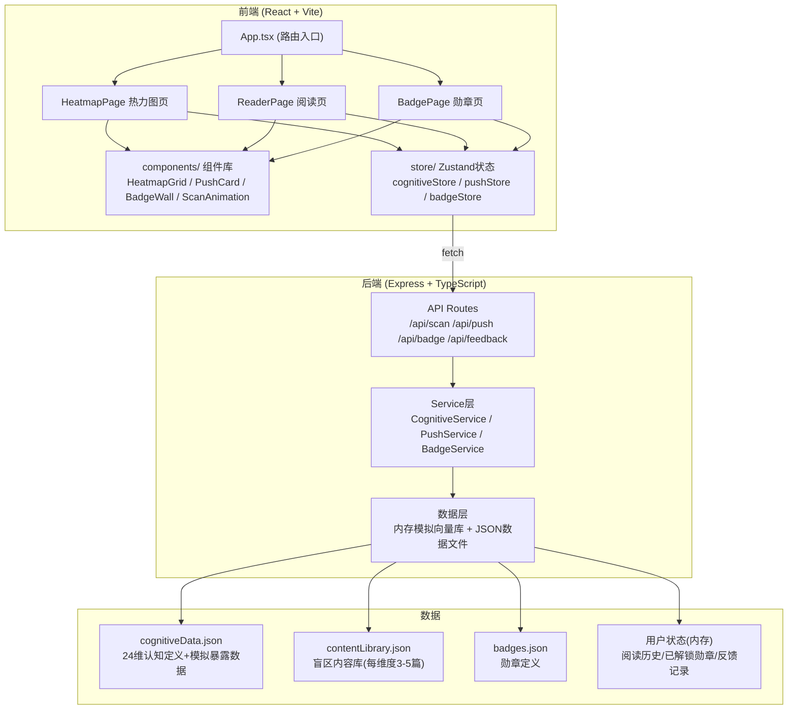
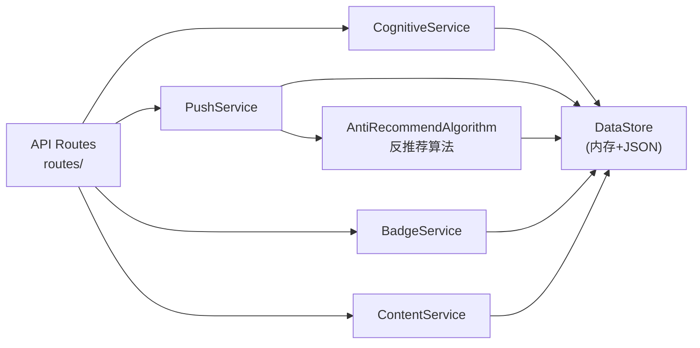
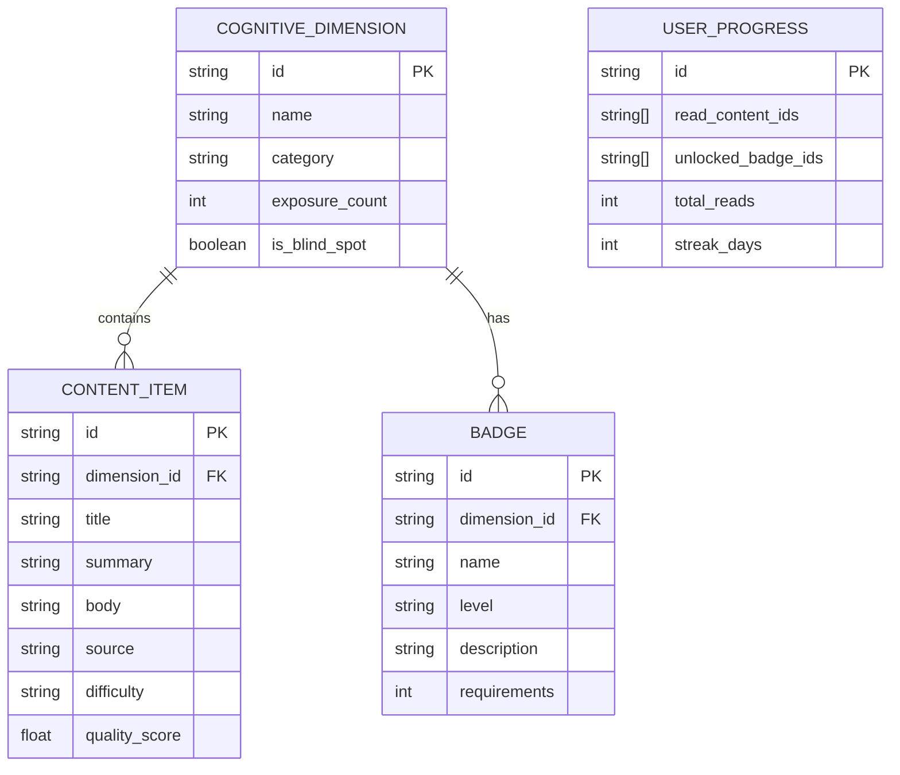

# 茧房爆破器 MVP — 技术架构文档

## 1. 架构设计



## 2. 技术选型说明

- **前端**:React 18 + TypeScript + Vite + Tailwind CSS 3 + Zustand + React Router
- **初始化工具**:vite-init (react-express-ts 模板)
- **后端**:Express 4 + TypeScript(与前端同语言,降低MVP复杂度)
- **数据存储**:MVP阶段用内存 + JSON文件模拟,生产环境迁移至Qdrant + PostgreSQL
- **动画**:CSS transitions + Framer Motion(轻量动效库)
- **图标**:lucide-react

## 3. 路由定义

| 路由 | 页面 | 用途 |
|------|------|------|
| `/` | HeatmapPage | 认知热力图主页(核心体验) |
| `/read/:contentId` | ReaderPage | 内容阅读 + 反馈 + 勋章解锁 |
| `/badges` | BadgePage | 勋章墙 + 成就统计 |

## 4. API 定义

### 4.1 类型定义

```typescript
// 认知维度
interface CognitiveDimension {
  id: string;
  name: string;
  category: string;
  exposureCount: number;  // 暴露次数
  isBlindSpot: boolean;   // 是否盲区
  lastExposureDate?: string;
}

// 内容
interface ContentItem {
  id: string;
  dimensionId: string;
  title: string;
  summary: string;
  body: string;
  source: string;
  difficulty: 'beginner' | 'intermediate' | 'advanced';
  qualityScore: number;
}

// 推送
interface PushResult {
  content: ContentItem;
  reason: string;  // "推荐这条是因为你过去30天从未接触过粒子物理学"
  blindSpotLevel: number; // 0-5,盲区程度
}

// 勋章
interface Badge {
  id: string;
  dimensionId: string;
  name: string;
  level: 'bronze' | 'silver' | 'gold';
  description: string;
  unlocked: boolean;
  unlockedAt?: string;
  requirements: number; // 需要阅读的篇数
}

// 用户状态
interface UserState {
  dimensions: CognitiveDimension[];
  readContentIds: string[];
  unlockedBadges: string[];
  totalReads: number;
  streakDays: number;
}
```

### 4.2 接口清单

| Method | Route | 用途 | 请求 | 响应 |
|--------|-------|------|------|------|
| GET | `/api/cognitive-map` | 获取认知热力图数据 | - | `{ dimensions: CognitiveDimension[] }` |
| POST | `/api/scan` | 触发认知扫描(刷新数据) | `{ days?: number }` | `{ dimensions: CognitiveDimension[], scanDate: string }` |
| POST | `/api/push/from-dimension` | 从指定维度获取推送 | `{ dimensionId: string }` | `PushResult` |
| POST | `/api/push/random-blind` | 随机盲区分发 | - | `PushResult` |
| GET | `/api/content/:id` | 获取内容详情 | - | `ContentItem` |
| POST | `/api/feedback` | 提交阅读反馈 | `{ contentId, dimensionId, feedback: string }` | `{ success: boolean, badgeUnlocked?: Badge }` |
| GET | `/api/badges` | 获取所有勋章及状态 | - | `{ badges: Badge[], stats: { total, unlocked, streak } }` |

## 5. 后端服务架构



## 6. 数据模型

### 6.1 数据结构定义



### 6.2 初始数据

- **认知维度**:24个,覆盖科学/艺术/社会/技术/人文五大类
- **内容库**:每个盲区维度3-5篇精选入门内容,共约60篇
- **勋章**:24个维度 × 3个等级(铜/银/金)= 72枚
- **模拟暴露数据**:模拟一个"重度娱乐内容消费者"的浏览历史

## 7. 核心算法

### 7.1 反推荐算法(Anti-Recommendation)

```typescript
function antiRecommend(dimensions: CognitiveDimension[], contentLibrary: ContentItem[]): PushResult {
  // 1. 找出所有盲区(暴露次数 < 阈值)
  const blindSpots = dimensions.filter(d => d.exposureCount < 5);
  
  // 2. 按盲区程度排序(次数越少越优先)
  blindSpots.sort((a, b) => a.exposureCount - b.exposureCount);
  
  // 3. 从前3个最盲区中随机选1个(增加多样性)
  const targetDim = blindSpots[Math.floor(Math.random() * Math.min(3, blindSpots.length))];
  
  // 4. 在该维度内容库中按质量分排序,选Top N中的一个
  const dimContents = contentLibrary
    .filter(c => c.dimensionId === targetDim.id)
    .sort((a, b) => b.qualityScore - a.qualityScore)
    .slice(0, 3);
  const content = dimContents[Math.floor(Math.random() * dimContents.length)];
  
  // 5. 生成推荐理由
  const reason = generateReason(targetDim);
  
  return { content, reason, blindSpotLevel: 5 - targetDim.exposureCount };
}
```

### 7.2 勋章解锁逻辑

```typescript
function checkBadgeUnlock(dimensionId: string, readCount: number): Badge | null {
  const badges = getBadgesByDimension(dimensionId);
  for (const badge of badges.sort((a,b) => b.requirements - a.requirements)) {
    if (readCount >= badge.requirements && !isUnlocked(badge.id)) {
      return badge;
    }
  }
  return null;
}
```

## 8. 项目目录结构

```
.
├── src/                    # 前端源码
│   ├── components/         # 组件
│   │   ├── HeatmapGrid.tsx
│   │   ├── PushCard.tsx
│   │   ├── BadgeWall.tsx
│   │   └── ScanAnimation.tsx
│   ├── pages/              # 页面
│   │   ├── HeatmapPage.tsx
│   │   ├── ReaderPage.tsx
│   │   └── BadgePage.tsx
│   ├── store/              # Zustand状态
│   │   └── useAppStore.ts
│   ├── types/              # 类型定义
│   │   └── index.ts
│   ├── App.tsx
│   └── main.tsx
├── api/                    # 后端源码
│   ├── routes/             # 路由
│   │   ├── cognitive.ts
│   │   ├── push.ts
│   │   ├── content.ts
│   │   ├── badge.ts
│   │   └── feedback.ts
│   ├── services/           # 业务逻辑
│   │   ├── CognitiveService.ts
│   │   ├── PushService.ts
│   │   ├── BadgeService.ts
│   │   └── ContentService.ts
│   ├── data/               # 数据
│   │   ├── cognitiveDimensions.json
│   │   ├── contentLibrary.json
│   │   └── badges.json
│   ├── store/              # 内存数据存储
│   │   └── DataStore.ts
│   └── index.ts            # Express入口
├── shared/                 # 前后端共享类型
│   └── types.ts
└── package.json
```
